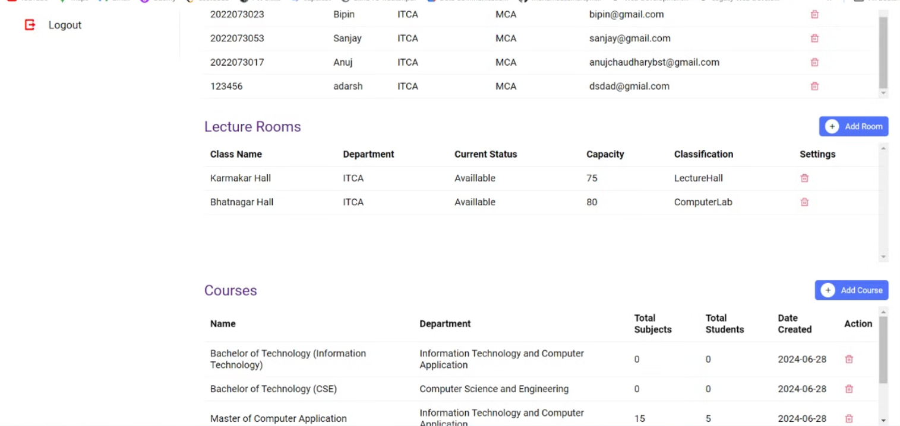

<!-- ABOUT THE PROJECT -->

## About The Project

We have developed an innovative and state-of-the-art attendance recorder that employs cutting-edge facial recognition technology. This sophisticated system enables effortless attendance recording while offering a comprehensive suite of advanced functionalities and in-depth analytical capabilities. In response to the stringent guidelines and precautions imposed during the COVID-19 pandemic, our solution has proven highly effective in eliminating the need for any form of physical interaction during the attendance collection and analysis process. It ensures a contactless and seamless experience, mitigating the risk of unnecessary physical encounters and adhering to the necessary safety protocols.

This powerful feature enables effective management of teachers, students, and their respective classes within the university or college ecosystem. By leveraging this digital classroom framework, our solution streamlines communication, assignment submission, grading, and overall collaboration between educators and learners.

## Usage

#### **Login Page**: Lets take a dive into our portal!

#### **Admin Dashboard Part 1**:

#### **Admin Dashboard Part 2**:

#### **Manage Courses Page**:

#### **Manage Lecturers Page**:

#### **Manage Students Page**

#### **Add Student Pop-up**

#### **Add Student Image using Webcam**

#### **Lecturer Login**

1. Take Attendance Page

   

2. During Attendance page

   

3. After Attendance Page

   

4. Enrolled Students Page

   

5. Download Attendance Page

   
